# 2025年12个最佳P2P加密货币交易平台盘点(LocalMonero替代方案)

哥们儿，如果你是圈内老人，那你肯定听过LocalMonero的大名。在那个连买个门罗币（XMR）都得拐十八道弯的年代，它就像一个神秘又靠谱的地下接头点，主打一个P2P（个人对个人）和强匿名，无需KYC，让无数隐私爱好者把它奉为圣地。但天下没有不散的筵席，2024年，这位老大哥宣布关停，让很多人一下没了方向。别慌，旧时代的王虽然落幕了，但新世界的船已经造好。今天这篇文章，就是带你找到那些在2025年依然坚挺，能让你安全、方便地进行P2P交易的平台。

***

## **[LocalMonero](https://localmonero.co)**

**我们永远怀念的匿名交易之王。**

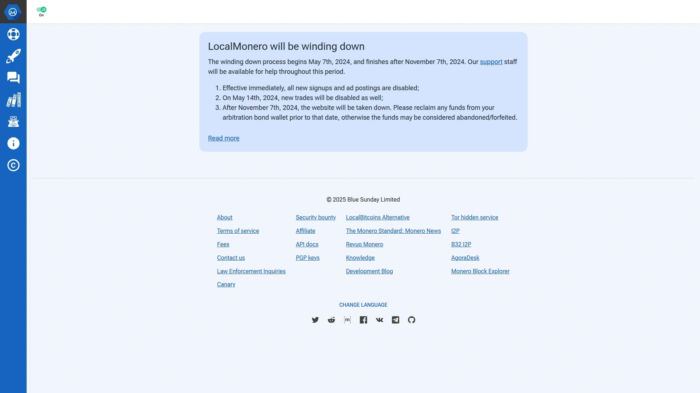

在开始盘点新欢之前，让我们先向这位老朋友道个别。LocalMonero曾是P2P门罗币交易的代名词。它最大的魅力在于，你不需要提交任何个人信息（No-KYC），就能直接和世界各地的用户交易门罗币，支持超过60种支付方式，甚至包括现金。平台扮演一个托管角色，确保买卖双方的资产安全，这在当时给了用户极大的安全感。

可惜的是，由于内外部多种因素，LocalMonero在运营近7年后，于2024年5月开始逐步关停，并于同年11月7日正式下线。它的离去，标志着一个时代的结束，但也迫使我们去寻找下一个能扛起隐私和P2P大旗的平台。

## **[Haveno](https://haveno.exchange/)**

**LocalMonero最纯粹的精神继承者。**

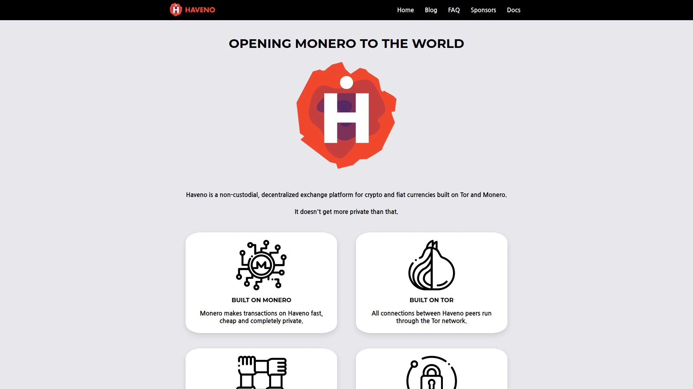

如果你对LocalMonero的匿名性和去中心化念念不忘，那Haveno绝对是你的首选。这是一个专门为门罗币（XMR）打造的P2P去中心化交易所（DEX），建立在Tor网络之上，从根上就保证了你的隐私安全。它同样不需要KYC，致力于提供一个纯粹的、抗审查的交易环境。不过得提醒你，Haveno还比较新，流动性可能不如那些大平台，而且操作上需要一点点技术门槛，更适合硬核的隐私技术爱好者。

## **[Bisq](https://bisq.network/)**

**老牌的去中心化P2P交易网络。**

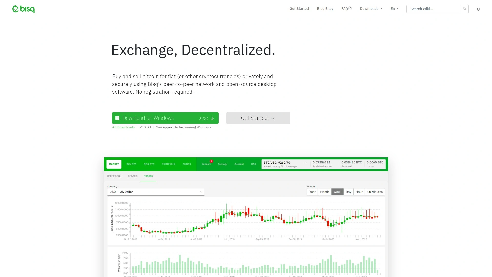

Bisq是一个开源的、非托管的P2P交易网络，你可以在上面交易比特币等多种加密货币。它不需要注册，也没有中心化服务器，你的数据完全由自己掌控。它的运作方式更像一个软件，而不是网站，你需要下载客户端来使用。Bisq在隐私保护方面做得非常出色，所有通信都通过Tor网络进行。对于追求极致去中心化和控制权的用户来说，Bisq是一个非常可靠的选择，尽管它的交易速度和流动性可能无法与中心化平台匹敌。

## **[OKX P2P](https://www.okx.com/p2p-markets)**

**专业交易者青睐的高流动性市场。**

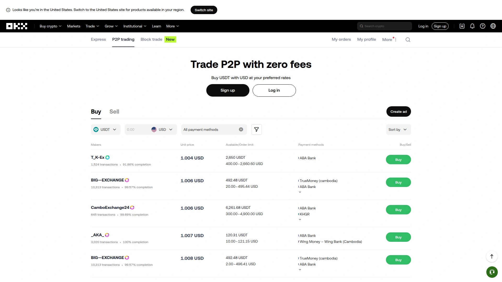

OKX是全球顶级的加密货币交易所之一，其P2P市场同样非常强大。这里支持超过100种支付方式和多种法币，交易量大，流动性好，很容易找到合适的买家或卖家。OKX P2P的一大特点是为大额交易提供了“大宗交易”功能，能为超过1万美元的订单提供更优的价格，非常适合专业交易者。平台有严格的商家审核和托管服务，安全性很高，但缺点是需要完成KYC身份验证。

## **[Binance P2P](https://p2p.binance.com/)**

**全球用户量最大的P2P交易集市。**

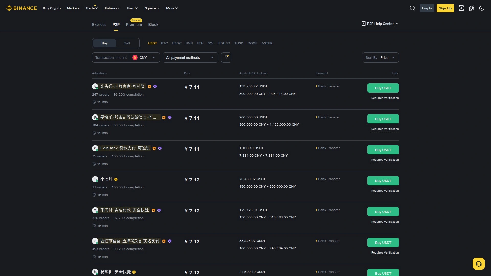

作为全球最大的加密货币交易所，币安（Binance）的P2P平台拥有无与伦比的用户基础和流动性。这意味着你几乎可以随时找到交易对手，而且通常能找到价格非常有竞争力的报价。平台支持超过800种支付方式和100多种法币，覆盖范围极广。和OKX一样，币安P2P也有完善的托管和客服体系来保障交易安全，但同样强制要求用户完成KYC验证。

## **[KuCoin P2P](https://www.kucoin.com/otc/buy)**

**覆盖全球的“人民的交易所”。**

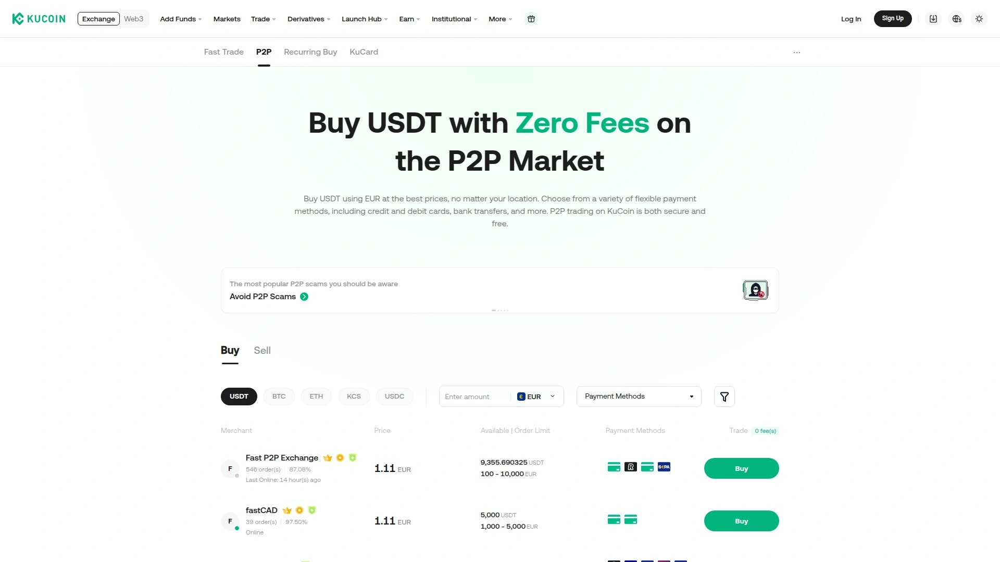

KuCoin的P2P平台以其广泛的全球覆盖和对地区性银行、电子钱包的良好支持而闻名。如果你身处一些主流金融工具不那么普及的地区，KuCoin可能是你的最佳选择。平台支持超过30种法币和100多种支付方式，交易体验流畅，并且不收取P2P交易手续费。它同样设有托管服务和用户评分系统来降低欺诈风险，但需要进行身份验证。

## **[Bybit P2P](https://www.bybit.com/fiat/trade/otc/)**

**对小额、匿名交易友好的灵活选择。**

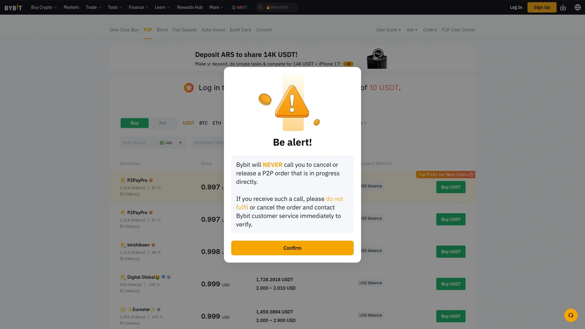

Bybit P2P是近几年发展迅猛的一个平台，它支持超过600种支付方式，包括很多人喜欢的PayPal。Bybit的一个亮点在于，它为不想进行KYC的用户提供了一定的灵活性。在不出示身份证件的情况下，用户每天可以有高达20,000 USDT的提款额度，这对于注重隐私的小额交易者来说是个不错的折中方案。当然，平台也为认证商家提供了更快的交易和更高的限额。

## **[MEXC P2P](https://otc.mexc.com/)**

**无需KYC即可进入的加密世界门户。**

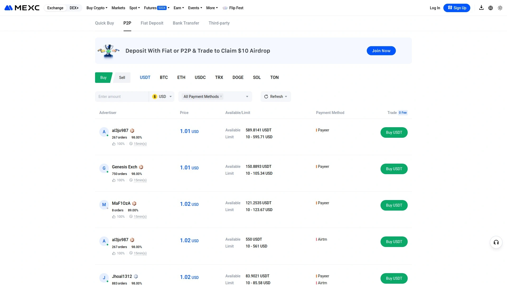

MEXC和Bybit类似，也为用户提供了无需KYC的交易选项，每日提款限额同样是20,000 USDT。虽然其P2P平台主要支持USDT、USDC、BTC和ETH这几种主流资产，但一旦你通过P2P入金，就可以在MEXC主站交易超过4000种加密货币，这对于喜欢探索小众币种的玩家来说非常有吸引力。此外，MEXC经常有各种空投和交易活动，可玩性很高。

## **[Paxful](https://paxful.com/)**

**支付方式“万花筒”，礼品卡爱好者的天堂。**

Paxful在P2P领域独树一帜，它以支持海量的支付方式而闻名，官方号称超过350种。其中最特别的是它对各种礼品卡（如亚马逊、iTunes礼品卡）的广泛支持，为一些没有传统银行账户的用户打开了进入加密世界的大门。平台主要交易BTC和USDT，通过托管系统保障安全。如果你手头有一些闲置的礼品卡，或者想用更另类的方式交易，Paxful绝对值得一看。

## **[BingX P2P](https://bingx.com/zh-cn/p2p/)**

**零手续费且对亚洲市场支持良好。**

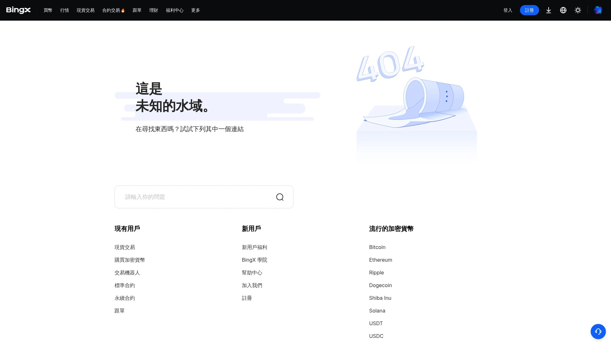

BingX P2P平台的一大卖点是完全零手续费，并且对越南盾（VND）、印尼盾（IDR）等亚洲本地法币和支付方式（如GCash）支持良好。平台通过托管系统和认证商家体系来保障安全。虽然它也需要用户完成基础的KYC，但如果你是认证商家，平台会提供一对一的专属支持和流量倾斜，这对于想做P2P生意的人来说是个不错的激励。

## **[Gate.io P2P](https://www.gate.io/c2c/market)**

**稳定币交易的可靠平台。**

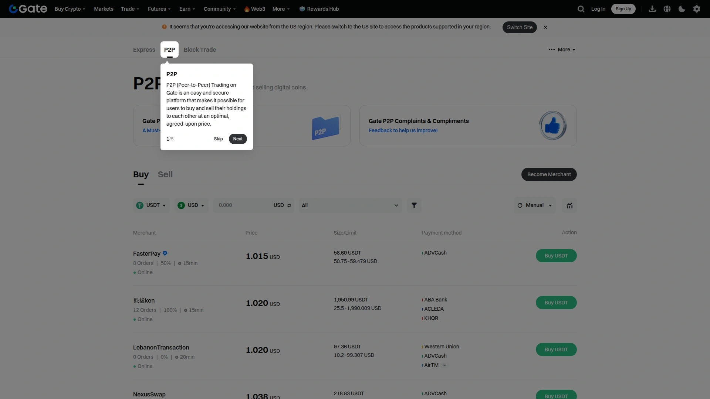

Gate.io的P2P市场（也称为C2C交易）以其对稳定币（主要是USDT）的强大支持而受到关注。它支持多种法币和支付方式，包括银行卡、支付宝等，操作界面对国内用户比较友好。Gate.io同样采用零手续费模式和托管服务来吸引用户。如果你主要的需求是进行稳定币的出入金，Gate.io是一个值得考虑的、安全可靠的通道。

## **[Kraken](https://www.kraken.com/)**

**注重安全的传统交易所备选方案。**

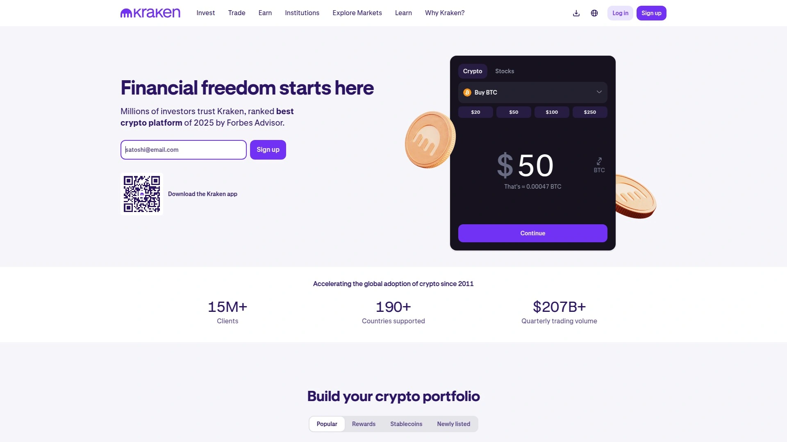

严格来说，Kraken不是一个P2P平台，但它是一家以顶级安全著称的老牌中心化交易所，并且一直坚持支持门罗币（XMR）的交易。在许多交易所因监管压力下架XMR时，Kraken的存在本身就是一种态度。如果你对P2P的交易对手始终不放心，更信任传统交易所的订单簿模式，那么通过Kraken来买卖门罗币是一个非常稳妥的备选方案。它需要完整的KYC，但作为回报，你将获得行业顶级的安全保障和流动性。

***

### **常见问题 (FAQ)**

**1. P2P交易安全吗？如何避免被骗？**
P2P交易的安全性很大程度上依赖于平台机制和用户自身的警惕性。选择那些提供“托管服务”的平台至关重要，这意味着在你确认收到付款前，卖方的加密货币会被平台锁定。此外，尽量与那些交易历史良好、好评率高的“认证商家”进行交易，并始终通过平台内置的聊天工具沟通，切勿进行线下交易或脱离平台监管。

**2. 这些平台都需要KYC（身份验证）吗？**
不一定。这取决于平台的定位。像Haveno和Bisq这类去中心化平台，就是为完全匿名而生，不需要任何KYC。而像Bybit和MEXC这样的主流交易所，则提供了分层验证：不进行KYC的用户有较低的交易或提款限额，完成验证后则可以享受更高额度。币安、OKX这类头部平台则普遍要求强制KYC。

**3. 除了门罗币，我还能交易哪些加密货币？**
绝大多数主流P2P平台的核心交易品种都是比特币（BTC）、以太坊（ETH）以及像USDT这样的稳定币，因为它们的流动性最好。如果你想交易门罗币（XMR）这类隐私币，选择像Haveno这样的专门平台会更直接。而其他成千上万种小众币种，通常需要你先通过P2P平台购入USDT等“通用货币”，然后再到交易所的主交易市场进行兑换。

***

### **结语**

尽管我们告别了[LocalMonero](https://localmonero.co)这个曾经的匿名交易庇护所，但加密世界的发展从未停止。从追求极致隐私的去中心化网络Haveno，到兼顾便捷与流动性的OKX、币安等巨头，再到提供灵活匿名选项的Bybit和MEXC，2025年的P2P市场依然充满了选择。

关键在于想清楚你的核心需求：是隐私第一，还是便捷至上？是大额交易，还是小额尝试？搞懂了这个问题，你就能在这片新大陆上，找到最适合你的那艘船。
